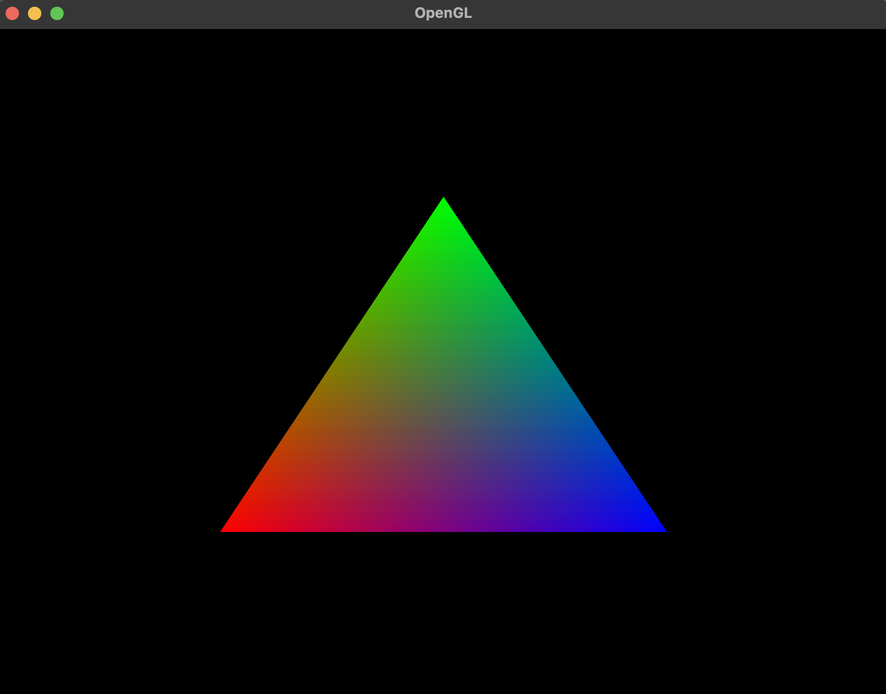
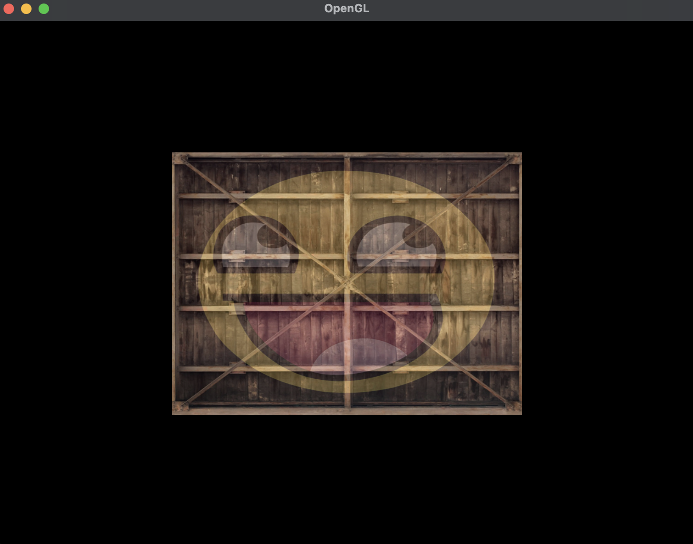

# OpenGL

## Instructions

> [!IMPORTANT]
> The program required GLFW installed on the machine

The default configuration expects that a macOS platform and GLFW installed via Homebrew.
However, you can specify a custom `GLFW_SDK_PATH` by passing the path as an argument for both
commands (e.g., `./scripts/build.sh /path/to/glfw`).

- **Build**: `./scripts/build.sh`
- **Run**: `./scripts/run.sh`

Additionally, the scripts are hardcoded for _debug_ mode.
Maybe in the future i may make this dynamic. For now, just change the script manually.

## Progress

**Triangle**

**Textures**

## References

- [Learn OpenGL](https://learnopengl.com)
